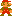
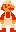
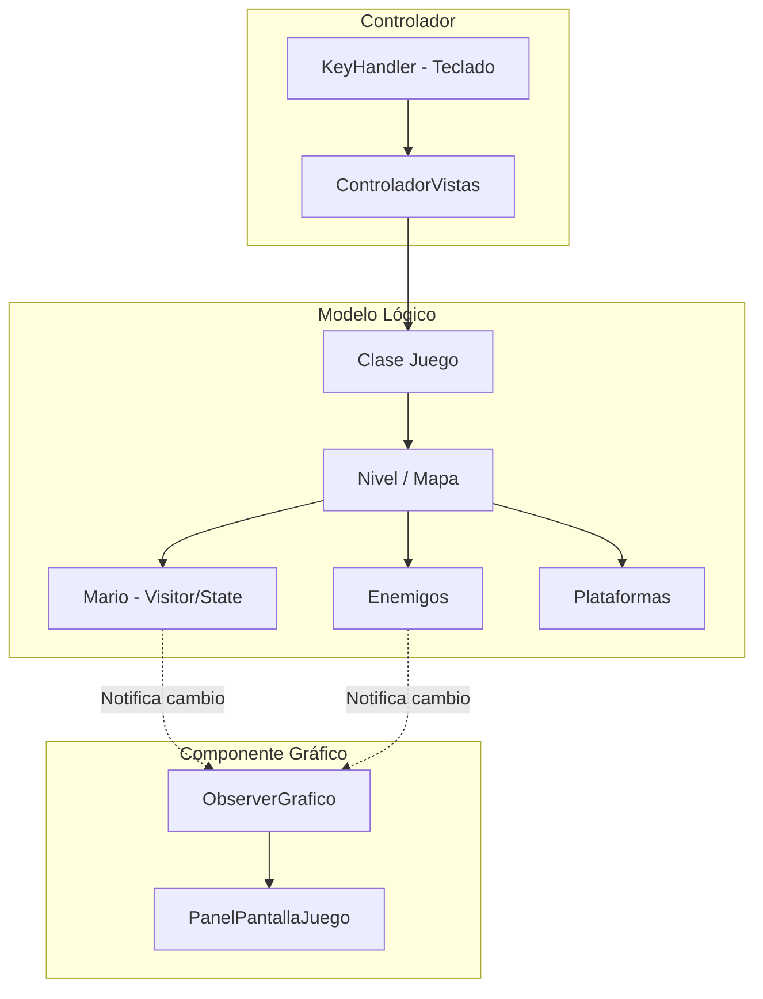

# 🎮 Mario Bros - Java Engine & OOP Architecture

<p align="center">
  
  
</p>

> **Proyecto Integrador** desarrollado para la materia **Tecnología de la Programación (TDP)**  
> **Universidad** — Calificación y estándares de código de grado académico.

---

## 📌 Resumen del Proyecto

Este proyecto consiste en una recreación y motor de juego funcional de **Super Mario Bros** desarrollado desde cero utilizando **Java 17** y la biblioteca gráfica **Swing/AWT**. El foco principal de este desarrollo no es únicamente el gameplay, sino la aplicación estricta de **patrones de diseño clásicos (GoF)**, principios de diseño **SOLID** y **concurrencia multihilo** para lograr un código altamente extensible, portable y desacoplado.

---

## 🏗️ Diagrama de Arquitectura de Alto Nivel

El motor sigue el patrón arquitectónico **Modelo-Vista-Controlador (MVC)**, donde las físicas lógicas se simulan en hilos paralelos independientes de la renderización gráfica:



---

## 🚀 Características Clave

1. **Arquitectura Multihilo**: Las físicas y movimientos del juego se ejecutan en hilos paralelos independientes (`ManagerMovimientoMario`, `ManagerMovimientoEnemigos`, `ManagerMovimientoBolaDeFuego`) sincronizados mediante tiempos lógicos (`Thread.sleep`), lo que independiza la fluidez física de la tasa de dibujo (render thread) de Swing.
2. **Sistema de Aspectos (Skins)**: Permite alternar dinámicamente entre el estilo gráfico clásico retro de la NES y un set de sprites modernos secundarios en tiempo de ejecución.
3. **Portabilidad Absoluta**: Los mapas de nivel, archivos de audio y sprites se cargan desde el classpath (`getResourceAsStream`), permitiendo empaquetar el juego completo en un único archivo ejecutable `.jar` autocontenido.
4. **Persistencia de Rankings**: Registro persistente y ordenamiento de puntajes máximos de jugadores, guardado de forma robusta en un archivo de disco detectado dinámicamente según el entorno.

---

## 🧩 Patrones de Diseño Implementados

### 1. Patrón Estado (State) — *Gestión de Power-ups*
Para evitar condicionales anidados complejos sobre el estado de Mario (chico, grande, con flor de fuego, estrella), su comportamiento está delegado a clases específicas que implementan la interfaz `EstadoMario`:
- `MarioNormal` (físicas base, muere de 1 golpe).
- `SuperMario` (altura doble, rompe ladrillos, resiste 1 golpe).
- `SuperMarioFuego` (dispara proyectiles de fuego).
- `MarioInvencible` y `MarioParpadeante` (estados temporales con físicas de inmunidad).

### 2. Patrón Visitor & Doble Despacho (Double Dispatch) — *Colisiones Polimórficas*
El motor físico resuelve las colisiones dinámicamente mediante el compilador. Cuando dos entidades chocan, se invoca un despacho doble que determina qué interactúa con qué sin usar costosas comprobaciones `instanceof`:
- `acceptMario(VisitorMario visitor, int lado)`
- `visit(Goomba goomba, int lado)` -> Resuelve instantáneamente el comportamiento de Mario colisionando con un Goomba por cualquier lado.

### 3. Patrón Observador (Observer) — *Sincronización Gráfica*
Las entidades lógicas (sujetos) no conocen la biblioteca Swing. Al cambiar sus coordenadas o estados:
1. Notifican a sus observadores gráficos correspondientes (`ObserverGrafico`, `ObserverJugador`).
2. El observador obtiene el sprite correspondiente y actualiza la posición del componente visual (`JLabel`) en la pantalla.

### 4. Patrón Fábrica (Abstract Factory / Factory Method) — *Motor de Skins*
La creación de sprites está delegada en una fábrica abstracta `FabricaSprites` con dos implementaciones concretas:
- `FabricaSpritesModoOriginal`
- `FabricaSpritesModoSecundario`
El motor puede cambiar toda la estética gráfica del juego de forma instantánea simplemente inyectando una fábrica diferente.

---

## 🛠️ Tecnologías y Requisitos

* **Lenguaje**: Java 17
* **Framework Gráfico**: Java Swing / AWT (Graphics2D)
* **Entorno**: Compatible con Windows, macOS y Linux
* **IDE Recomendado**: Eclipse IDE, VS Code o IntelliJ IDEA

---

## 📦 Instrucciones para Compilar y Ejecutar

### Desde Consola (Powershell / Bash)
1. Clona el repositorio:
   ```bash
   git clone https://github.com/Jano-C/mario-bros.git
   cd mario-bros
   ```
2. Compila el código fuente y genera el binario:
   ```bash
   javac -d CodigoFuente/bin -sourcepath CodigoFuente/src CodigoFuente/src/Launcher/Launcher.java
   ```
3. Ejecuta el Launcher:
   ```bash
   java -XX:+ShowCodeDetailsInExceptionMessages --module-path CodigoFuente/bin -m JuegoMarioBroa/Launcher.Launcher
   ```
